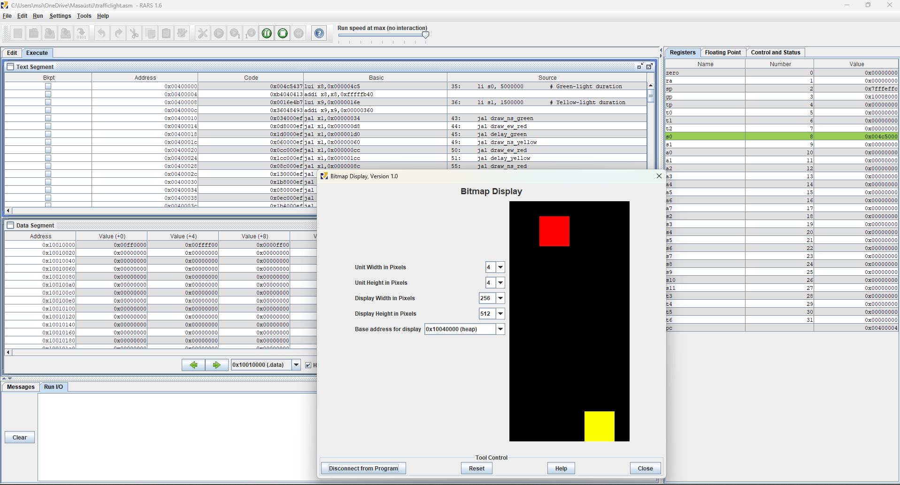
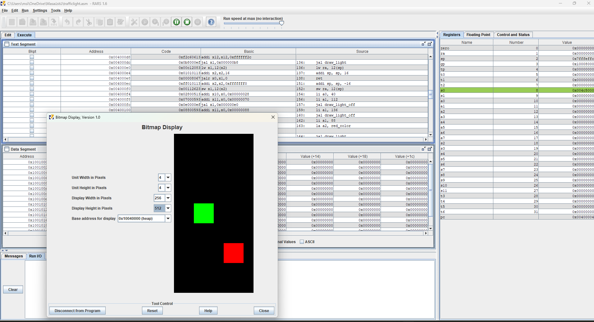

# 🚦 RISC-V Traffic Light Simulation

A traffic light control simulation developed in **RISC-V Assembly** using the **RARS Bitmap Display**.

This project demonstrates fundamental computer architecture concepts such as memory-mapped graphics, low-level programming, and state-based traffic light control.

---

## 📸 Simulation

---

## 📖 Overview

The simulation controls two independent traffic directions using a four-state finite state sequence.

### Traffic Sequence

1. 🟢 North–South Green | 🔴 East–West Red
2. 🟡 North–South Yellow | 🔴 East–West Red
3. 🔴 North–South Red | 🟢 East–West Green
4. 🔴 North–South Red | 🟡 East–West Yellow

The sequence repeats continuously using software delay loops.

---

## ✨ Features

- RISC-V Assembly implementation
- Bitmap Display graphics
- Memory-mapped display access
- Four-state traffic signal control
- Continuous simulation loop

---

## 🛠 Technologies

- RISC-V Assembly
- RARS Simulator
- Bitmap Display

---

## ▶️ How to Run

1. Open `trafficlight.asm` in **RARS**.
2. Open **Tools → Bitmap Display**.
3. Set the display base address to **0x10040000**.
4. Click **Connect to Program**.
5. Assemble and run the program.

---

## 📷 Additional Simulation States

| State 2 | State 3 |
|---------|---------|
|  |  |

---

## 👨‍💻 Author

**Muhammet Azat Taş**

Computer Engineering Student
